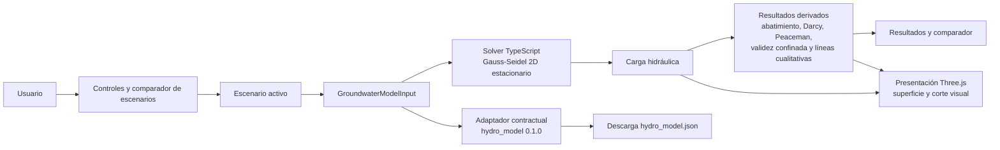

# AquiferLab

[English](README.md) | Español

AquiferLab es un laboratorio web interactivo para experimentar con un acuífero
confinado simplificado y observar cómo el bombeo y los parámetros hidráulicos
modifican sus resultados. Combina cálculo 2D, visualización 3D y escenarios
comparables. No sustituye MODFLOW ni representa un acuífero real calibrado.

## Problema y uso actual

Explorar cómo los cambios de bombeo, conductividad, espesor, recarga o
referencia hidráulica alteran un modelo suele exigir separar el cálculo de su
representación y repetir configuraciones comparables. AquiferLab reúne ese
recorrido en una interfaz interactiva para contrastar escenarios simplificados
de un acuífero confinado. Está pensado actualmente para aprendizaje,
demostración técnica y revisión de supuestos de un modelo simplificado; no para
diseñar, calibrar o predecir el comportamiento de un acuífero real.

Un uso conceptual consiste en crear escenarios con distintas tasas o posiciones
de los pozos, ejecutar cada uno y comparar las cargas, el abatimiento y las
advertencias de validez del régimen confinado. Cada escenario puede usar una
referencia hidráulica de río o regional y admite dos pozos de extracción
reposicionables dentro del dominio, fuera de las celdas de carga fija.

## Capacidades actuales

- Resuelve un campo 2D estacionario de carga hidráulica mediante Gauss-Seidel
  sobre una malla regular.
- Modela un acuífero confinado, homogéneo e isotrópico, de espesor constante,
  con recarga distribuida, celdas de carga fija y hasta dos pozos de extracción.
- Calcula abatimiento frente a un escenario de referencia sin bombeo y muestra
  métricas de celda y una estimación dentro del pozo mediante la corrección de
  Peaceman.
- Calcula y visualiza la descarga específica de Darcy `q = -K ∇h` en las
  celdas interiores. Es descarga específica, no velocidad intersticial: no se
  calcula porosidad efectiva ni velocidad de partículas.
- Superpone líneas de flujo **cualitativas** a partir de la dirección
  normalizada de la descarga de Darcy. Indican dirección; no son trayectorias
  de partículas, ni representan tiempo de viaje, transporte o dispersión.
- Muestra una superficie piezométrica y un corte geológico interactivo con
  Three.js. El corte y las capas geológicas son visuales y no alteran ni
  recalculan el modelo hidráulico.
- Permite editar, nombrar, añadir y retirar escenarios, con un comparador de
  uno a cuatro escenarios. Los parámetros y posiciones de pozo pertenecen a
  cada escenario.
- Ofrece interfaz y ayuda contextual en español e inglés.
- Evalúa si las cargas de la malla y las estimaciones de pozo permanecen sobre
  la cota configurada del techo del acuífero. Si no, señala que la solución es
  una extrapolación fuera del rango del modelo confinado.
- Descarga el escenario activo como `hydro_model.json` cuando puede
  representarse sin pérdida por el contrato `hydro_model` 0.1.0.

## Arquitectura



El solver y los cálculos derivados son módulos TypeScript separados de la capa
Three.js. La escena recibe resultados ya calculados; no resuelve el flujo. Los
escenarios conservan sus propios parámetros y materializan el `GroundwaterModelInput`
que se ejecuta, lo que hace que la comparación use configuraciones explícitas.

## Modelo científico y supuestos

El solver resuelve la forma discreta de:

`∇ · (T ∇h) + R - Q = 0`, con `T = K × b`.

Las unidades internas son metros y días: `K` en m/día, `T` en m²/día, recarga
en m/día, bombeo en m³/día y carga hidráulica en m. La interfaz convierte K
desde m/s, recarga desde mm/año y bombeo desde L/s.

El modelo supone régimen estacionario, acuífero completamente confinado,
homogéneo e isotrópico y espesor constante. Las celdas de carga fija representan
la referencia hidráulica; los bordes sin vecino se tratan como no flujo. La
convergencia numérica sólo indica que el esquema discreto alcanzó su tolerancia:
no garantiza que los supuestos físicos sean válidos.

La comprobación del régimen confinado compara la carga de cada celda y las
estimaciones Peaceman de los pozos con la cota del techo del acuífero, usando el
mismo datum. Si alguna carga queda por debajo, AquiferLab conserva el resultado
numérico pero lo declara fuera de rango; no limita cargas, no simula
desaturación y no cambia a un modelo no confinado.

### Resultados cuantitativos y visualizaciones cualitativas

| Resultado | Alcance |
| --- | --- |
| Carga hidráulica, abatimiento y descarga específica de Darcy | Resultados del modelo discreto, condicionados por sus entradas y supuestos. |
| Estimación dentro del pozo | Posproceso Peaceman para un pozo ideal completamente penetrante; no modifica el solver, la superficie ni el campo de Darcy. |
| Flechas de Darcy | Muestran `q = -K ∇h`; su longitud se normaliza para legibilidad. No representan velocidad intersticial. |
| Líneas de flujo | Visualización cualitativa de dirección basada en `q / |q|`; no son partículas ni proporcionan tiempos de viaje. |
| Corte geológico y capas | Contexto visual esquemático; no representa geología real ni participa en el cálculo. |

## Decisiones de diseño observables

- **Aplicación web con Vite y TypeScript.** El producto actual se entrega como
  una SPA ejecutable localmente; no existe aplicación de escritorio, backend ni
  servicio remoto en este repositorio.
- **Cálculo separado de Three.js.** El motor hidráulico, el campo de Darcy, las
  líneas y las validaciones se calculan fuera de la escena, que sólo presenta
  datos recibidos.
- **Escenario como unidad de comparación.** Cada escenario contiene sus
  parámetros y su referencia hidráulica; el comparador limita la interfaz a
  cuatro escenarios para contrastarlos simultáneamente.
- **Líneas deliberadamente cualitativas.** Se integran sobre la dirección
  normalizada de Darcy, sin porosidad ni modelo de transporte; por eso no se
  presentan como predicción de trayectorias o tiempos.
- **Validez confinada explícita.** La comprobación frente al techo del acuífero
  evita presentar sin advertencia una solución de transmisividad constante
  fuera de su rango físico.
- **Peaceman como posproceso.** Distingue la carga de celda de una estimación
  dentro del pozo sin alterar el solve de la malla.
- **Exportación contractual, no integración de simulador.** La descarga sigue
  un contrato JSON acotado; no ejecuta, importa ni integra MODFLOW.

## Escenarios y exportación `hydro_model`

El comparador permite de uno a cuatro escenarios. Al modificar un escenario se
actualizan sus propios parámetros; los pozos A y B se reposicionan por sus
coordenadas de celda dentro del dominio y no pueden ocupar una celda de carga
fija.

El botón de exportación prepara una descarga llamada `hydro_model.json`. El
contrato actual es `hydro_model` 0.1.0 y contiene estado confinado y
estacionario, unidades m/día, malla, propiedades del acuífero, cargas fijas y
pozos de extracción. Sólo se permite exportar cuando la recarga es exactamente
cero: si la recarga es distinta de cero, la exportación se rechaza para no
descartar información. Esta exportación no equivale a compatibilidad ni
integración con MODFLOW.

## Límites y usos no válidos

No use AquiferLab como sustituto de MODFLOW, para decisiones de campo ni para
representar un acuífero real sin un flujo de trabajo hidrogeológico externo. No
incluye ni demuestra:

- datos hidrogeológicos reales, GIS/GPS, calibración o capacidad predictiva
  para un sitio real;
- acuífero libre, desaturación, almacenamiento ni comportamiento transitorio;
- heterogeneidad espacial, anisotropía, transporte, dispersión, partículas o
  velocidad intersticial;
- PWA/offline, backend, persistencia de escenarios u hosting público;
- compatibilidad verificada con navegadores, sistemas operativos o dispositivos
  concretos.

## Ejecución local

Requiere Node.js y npm. La validación actual se realizó con Node `v24.19.0` y
npm `11.17.0`. Todavía no se ha ejecutado una matriz de compatibilidad con
otras versiones, navegadores o plataformas.

```bash
npm ci
npm run dev
```

Para generar la compilación de producción local:

```bash
npm run build
```

## Pruebas y validación

La suite cubre el solver, cálculos derivados, escenarios, exportación contractual
y componentes de presentación. Ejecute:

```bash
npm test
npm run typecheck
npm run build
```

## Demo pública futura

El workflow de GitHub Actions valida tests, typecheck y build, y queda preparado
para publicar `dist/` en GitHub Pages desde `main`. Aún no existe una URL
pública: crear/configurar el repositorio en GitHub y autorizar su publicación
son pasos posteriores.

## Tecnologías y estado

AquiferLab usa TypeScript, Vite, Three.js y Vitest. Es un proyecto en desarrollo
orientado a exploración y presentación verificable de un modelo simplificado;
no se presenta como producto desplegado ni como herramienta hidrogeológica de
producción.

## Licencia

GNU General Public License v3.0 or later (GPL-3.0-or-later)
