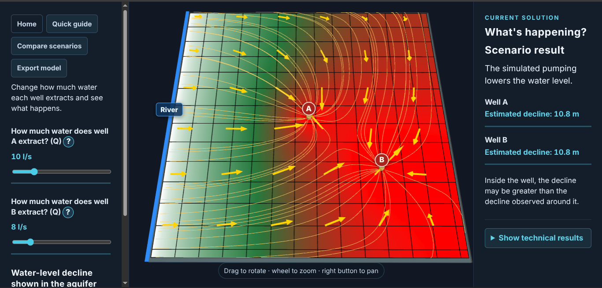
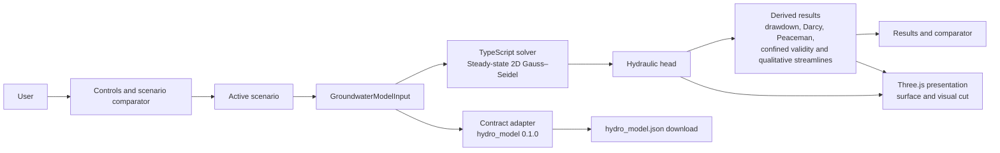

# AquiferLab

Interactive groundwater modeling laboratory for exploring pumping, hydraulic
parameters, drawdown, and flow behavior in a simplified confined aquifer.

[](https://github.com/jov-labs/AquiferLab/actions/workflows/pages.yml)
[](https://jov-labs.github.io/AquiferLab/)
[](https://github.com/jov-labs/AquiferLab/blob/main/LICENSE)

**[Open the live demo →](https://jov-labs.github.io/AquiferLab/)**



English | [Español](README.es.md)

AquiferLab combines 2D calculation, 3D visualization, and comparable scenarios.
It does not replace MODFLOW or represent a calibrated real aquifer.

## Problem and current use

Exploring how changes in pumping, conductivity, thickness, recharge, or
hydraulic reference alter a model usually requires separating the calculation
from its representation and repeating comparable configurations. AquiferLab
brings that process together in an interactive interface for contrasting
simplified confined-aquifer scenarios. It is currently intended for learning,
technical demonstration, and review of simplified-model assumptions; not for
designing, calibrating, or predicting the behaviour of a real aquifer.

A conceptual use consists of creating scenarios with different well rates or
positions, running each one, and comparing heads, drawdown, and confined-regime
validity warnings. Each scenario can use a river or regional hydraulic reference
and supports two repositionable extraction wells within the domain, outside
fixed-head cells.

## Current capabilities

- Solves a steady-state 2D hydraulic-head field using Gauss–Seidel on a regular
  grid.
- Models a homogeneous, isotropic confined aquifer of constant thickness, with
  distributed recharge, fixed-head cells, and up to two extraction wells.
- Calculates drawdown against a no-pumping reference scenario and shows cell
  metrics and an in-well estimate using the Peaceman correction.
- Calculates and visualizes Darcy specific discharge `q = -K ∇h` in interior
  cells. It is specific discharge, not interstitial velocity: neither effective
  porosity nor particle velocity is calculated.
- Overlays **qualitative** streamlines based on the normalized direction of
  Darcy specific discharge. They indicate direction; they are not particle
  trajectories and do not represent travel time, transport, or dispersion.
- Shows a piezometric surface and an interactive geological cut with Three.js.
  The cut and geological layers are visual and do not alter or recalculate the
  hydraulic model.
- Allows scenarios to be edited, named, added, and removed, with a comparator
  for one to four scenarios. Parameters and well positions belong to each
  scenario.
- Provides interface and contextual help in Spanish and English.
- Evaluates whether grid heads and well estimates remain above the configured
  elevation of the aquifer top. If not, it indicates that the solution is an
  extrapolation outside the range of the confined model.
- Downloads the active scenario as `hydro_model.json` when it can be represented
  without loss by the `hydro_model` 0.1.0 contract.

## Architecture



The solver and derived calculations are TypeScript modules separated from the
Three.js layer. The scene receives already calculated results; it does not solve
flow. Scenarios retain their own parameters and materialize the
`GroundwaterModelInput` that is run, so comparison uses explicit configurations.

## Scientific model and assumptions

The solver solves the discrete form of:

`∇ · (T ∇h) + R - Q = 0`, with `T = K × b`.

Internal units are metres and days: `K` in m/day, `T` in m²/day, recharge in
m/day, pumping in m³/day, and hydraulic head in m. The interface converts K
from m/s, recharge from mm/year, and pumping from L/s.

The model assumes steady state, a fully confined aquifer, homogeneous and
isotropic conditions, and constant thickness. Fixed-head cells represent the
hydraulic reference; edges without a neighbour are treated as no-flow. Numerical
convergence only indicates that the discrete scheme reached its tolerance: it
does not guarantee that the physical assumptions are valid.

The confined-regime check compares every cell head and Peaceman well estimate
with the elevation of the aquifer top, using the same datum. If any head falls
below it, AquiferLab retains the numerical result but declares it out of range;
it does not cap heads, simulate desaturation, or switch to an unconfined model.

### Quantitative results and qualitative visualizations

| Result | Scope |
| --- | --- |
| Hydraulic head, drawdown, and Darcy specific discharge | Discrete-model results, conditioned by their inputs and assumptions. |
| In-well estimate | Peaceman post-processing for an ideal fully penetrating well; it does not modify the solver, surface, or Darcy field. |
| Darcy arrows | Show `q = -K ∇h`; their length is normalized for readability. They do not represent interstitial velocity. |
| Streamlines | Qualitative direction visualization based on `q / |q|`; they are not particles and do not provide travel times. |
| Geological cut and layers | Schematic visual context; they do not represent real geology or participate in the calculation. |

## Observable design decisions

- **Web application with Vite and TypeScript.** The current product is delivered
  as a locally runnable SPA; this repository contains no desktop application,
  backend, or remote service.
- **Calculation separated from Three.js.** The hydraulic engine, Darcy field,
  lines, and validations are calculated outside the scene, which only presents
  received data.
- **Scenario as the comparison unit.** Each scenario contains its parameters
  and hydraulic reference; the comparator limits the interface to four scenarios
  for simultaneous contrast.
- **Deliberately qualitative streamlines.** They are integrated over normalized
  Darcy direction, without porosity or a transport model; therefore they are not
  presented as predictions of trajectories or times.
- **Explicit confined validity.** The check against the aquifer top avoids
  presenting a constant-transmissivity solution outside its physical range
  without a warning.
- **Peaceman as post-processing.** It distinguishes cell head from an in-well
  estimate without altering the grid solve.
- **Contract export, not simulator integration.** The download follows a bounded
  JSON contract; it does not run, import, or integrate MODFLOW.

## Scenarios and `hydro_model` export

The comparator supports one to four scenarios. When a scenario is modified, its
own parameters are updated; wells A and B are repositioned by their cell
coordinates within the domain and cannot occupy a fixed-head cell.

The export button prepares a download named `hydro_model.json`. The current
contract is `hydro_model` 0.1.0 and contains confined and steady-state status,
m/day units, grid, aquifer properties, fixed heads, and extraction wells. Export
is permitted only when recharge is exactly zero: if recharge is non-zero, export
is rejected so that information is not discarded. This export does not constitute
MODFLOW compatibility or integration.

## Limits and invalid uses

Do not use AquiferLab as a substitute for MODFLOW, for field decisions, or to
represent a real aquifer without an external hydrogeological workflow. It does
not include or demonstrate:

- real hydrogeological data, GIS/GPS, calibration, or predictive capability for
  a real site;
- unconfined aquifers, desaturation, storage, or transient behaviour;
- spatial heterogeneity, anisotropy, transport, dispersion, particles, or
  interstitial velocity;
- PWA/offline capability, a backend, or scenario persistence;
- verified compatibility with specific browsers, operating systems, or devices.

## Local execution

Requires Node.js and npm. Current validation was performed with Node `v24.19.0`
and npm `11.17.0`. A compatibility matrix for other versions, browsers, or
platforms has not yet been run.

```bash
npm ci
npm run dev
```

To generate the local production build:

```bash
npm run build
```

## Tests and validation

The suite covers the solver, derived calculations, scenarios, contract export,
and presentation components. Run:

```bash
npm test
npm run typecheck
npm run build
```

## Live demo

The GitHub Actions workflow validates tests, typecheck, and build, then publishes
`dist/` to GitHub Pages from `main`. The live demo is available at
https://jov-labs.github.io/AquiferLab/.

## Technologies and status

AquiferLab uses TypeScript, Vite, Three.js, and Vitest. It is a project under
development, oriented toward exploration and verifiable presentation of a
simplified model; it is not presented as a production hydrogeological tool.

## License

GNU General Public License v3.0 or later (GPL-3.0-or-later)
